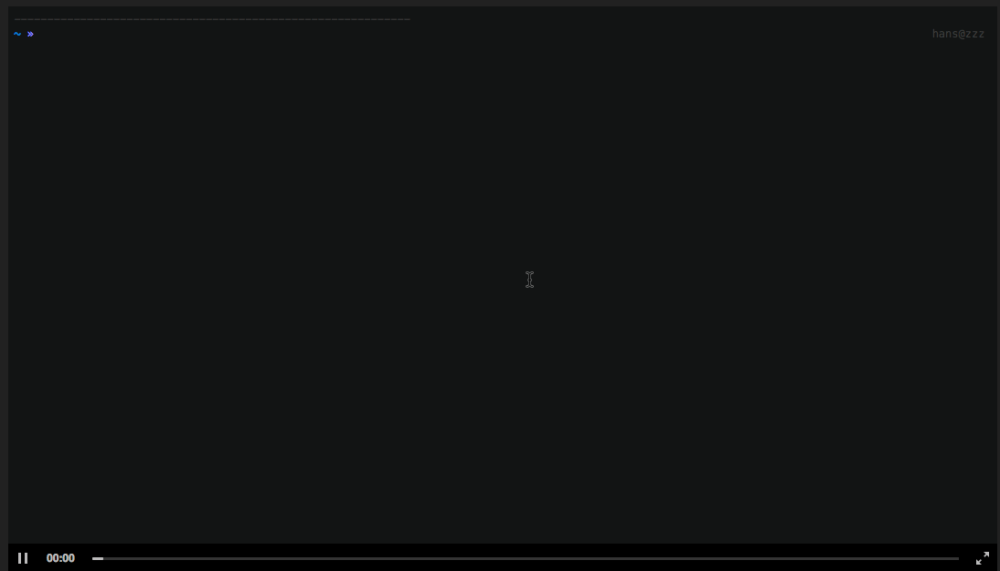

# 下载&运行

## 环境要求

* node >= 6.0.0
* npm >= 3.0.0
* java = 1.8
* maven >= 3
* mysql >= 5.3

## 方式一：脚手架快速配置

* 1 安装脚手架

```bash
npm install -g itheima-cli
```

> 需要 `node` 环境，请自行安装 `nodejs.org`

更多脚手架信息请移步 [itheima-cli](https://www.npmjs.com/package/itheima-cli)

* 2 执行安装

```bash
itheima init itheimaAdmin-template my-admin
```

按提示 `enter` `enter` 就完成了，就这么简单。

!> 环境必须配置好啊！ 如：`maven` ，否者 `mvn` 命令执行不了。

**安装录像：**



## 方式二：下载源码，手动配置

?> 本项目是前后端分离，需要先启动后端服务，然后再运行前端项目。

### 1. java 后端

#### 1.1 克隆项目 git

```bash
git clone https://github.com/itheima2017/vue-element-admin-api-java-itheima.git
```

#### 1.2 新建数据库

  登录mysql，创建名为 your-database-name 的数据库

#### 1.3 修改默认配置

```bash
#修改默认配置
vim ./your-project/src/main/resources/application.yml

#修改数据库配置
spring:
  datasource:
    url: jdbc:mysql://localhost:3306/your-database-name?useUnicode=true&characterEncoding=utf8
    username: root   #数据库账号
    password: root   #数据库密码

#修改端口
server:
  port: 7999
```

#### 1.4 初始化数据库

```bash
#进入数据库初始化文件目录
cd ./your-project/db

#运行初始化文件
mysql -uroot -proot < init.sql
```

> mysql -u账号 -p密码 -D数据库名称 < sql文件路径

#### 1.5 打包及运行

```bash
#进入项目目录
cd your-project

#打包
mvn clean package

```

#### 1.6 运行服务

```bash
nohup ./your-project/target/vue-element-admin-api-1.0.0.jar
```

### 2. VUE 前端

#### 2.1 克隆项目 git

```bash
# 克隆项目
git clone https://github.com/itheima2017/vue-element-admin-itheima.git

# 安装依赖
npm install
# 或者 用淘宝镜像加速
npm install --registry=https://registry.npm.taobao.org
```

#### 2.2 修改 `API` 地址

编辑文件 `config/index.js`

```js
  ...
  proxyTable: {
    '/api': {
      target: 'http://localhost:7999',
      changeOrigin: true,
      pathRewrite: {
        '^/api': ''
      }
    }
  },
  ...
```

> `target` 是请求的API地址

#### 2.3 启动前端

```bash
npm run dev
```


打开浏览器访问 http://localhost:8080


